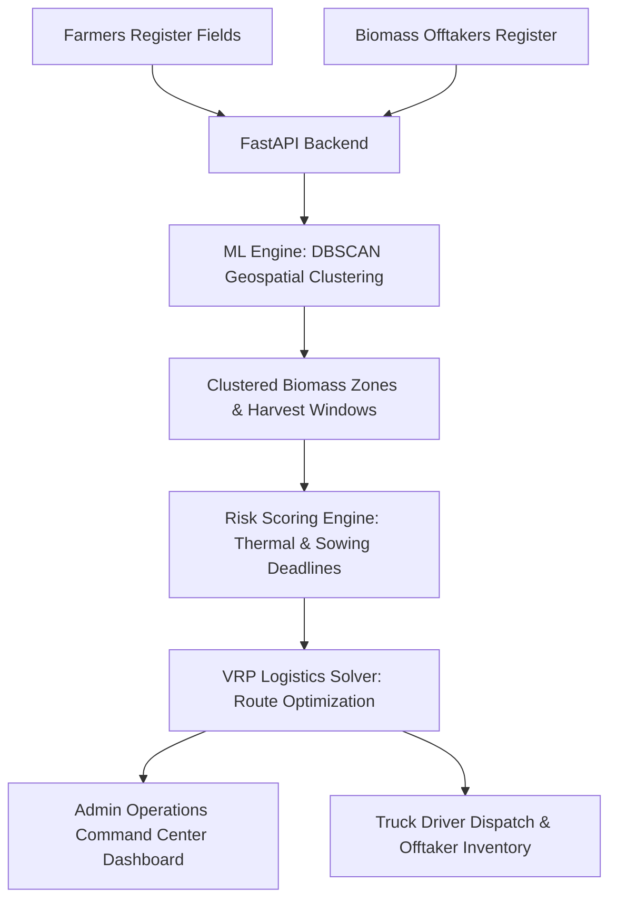

# StubbleConnect Architecture Overview (SIH 2026)

## System Flowchart

## Core Components
1. **Frontend**: React 19, Tailwind CSS v4, Lucide Icons, Leaflet.js with ESRI Satellite imagery.
2. **Backend**: FastAPI, Pydantic v2, RESTful API layer.
3. **ML Engine**: Scikit-Learn DBSCAN, OR-Tools VRP Solver, Burning Risk Scoring.
4. **Logistics**: Multi-stop pickup routes with real-time capacity progress bars.
